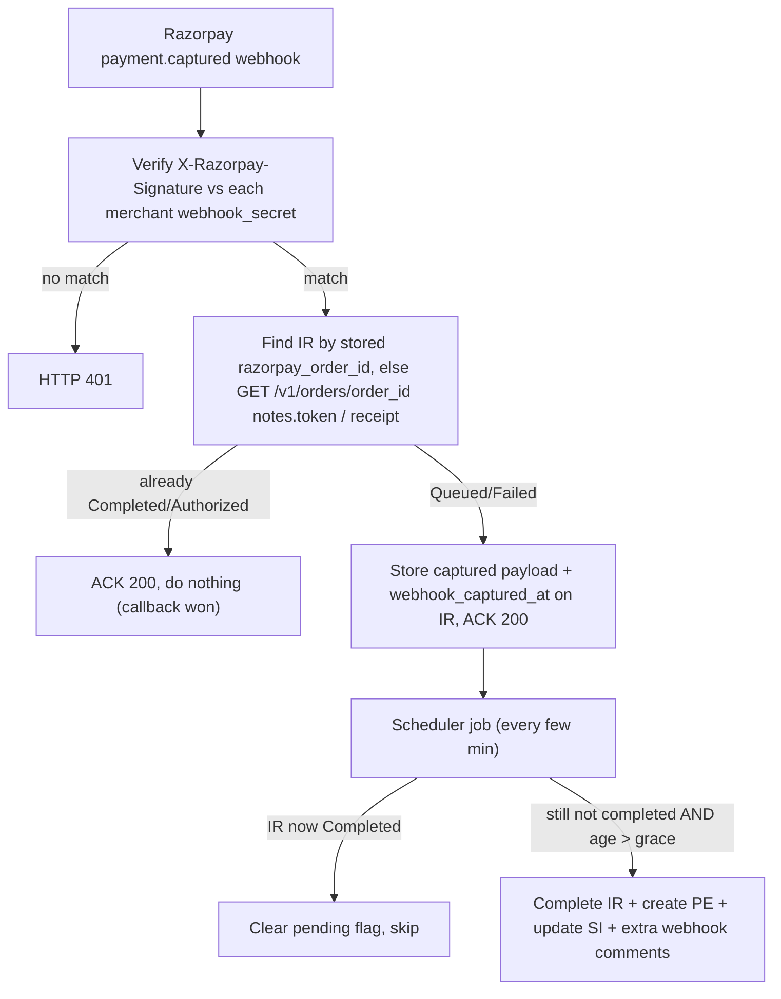

## Goal

Add a Razorpay `payment.captured` webhook that is a **fallback only**. The existing callback (`verify_payment` / `order_payment_success` -> `authorize_payment`) stays the primary path. The webhook completes a `Queued` Integration Request (IR) -> creates Payment Entry -> updates Sales Invoice **only if the callback did not do so within a short grace period**. Existing audit comments are preserved; an extra "completed by webhook" comment is added when the webhook does the work.

## Decisions (confirmed)
- Payment Entry `reference_no` stays `razorpay_payment_id` for both paths (safe de-duplication). UPI RRN/UTR is added to remarks + comments only.
- Per-merchant webhook secret (new field), with global fallback on Settings. Merchant is identified by which secret validates the signature.
- Webhook processing is deferred by a short grace period so the callback normally wins; skipped if the IR is already `Completed`/`Authorized`.

## Flow

## Changes

### 1. New `webhook_secret` fields
- [payments/payment_gateways/doctype/razorpay_merchant/razorpay_merchant.json](payments/payment_gateways/doctype/razorpay_merchant/razorpay_merchant.json): add `webhook_secret` (Password) field.
- [payments/payment_gateways/doctype/razorpay_settings/razorpay_settings.json](payments/payment_gateways/doctype/razorpay_settings/razorpay_settings.json): add `webhook_secret` (Password) global-fallback field.

### 2. Persist `razorpay_order_id` at order creation
In `create_order` in [payments/payment_gateways/doctype/razorpay_settings/razorpay_settings.py](payments/payment_gateways/doctype/razorpay_settings/razorpay_settings.py), after the order is created, write `razorpay_order_id` (and `receipt`) back into the IR `data` JSON so the webhook can locate the still-`Queued` IR by order id without an API call. (Existing stuck IRs are handled by the `GET /v1/orders/{order_id}` notes/receipt fallback.)

### 3. Refactor the callback success path for reuse
Extract the reference-doc handling block from `authorize_payment` (the part that adds the audit comment and dispatches to the Sales Invoice / Payment Request / Customer handlers) into a shared helper, e.g. `run_payment_success_handlers(integration_request, data, status, source)`, where `source` is `"callback"` or `"webhook"`. `authorize_payment` keeps building redirect URLs and calls this helper. The existing audit comment (the `Razorpay Payment Processed` block, `razorpay_settings.py` ~lines 367-378) is unchanged; when `source == "webhook"` it additionally adds a comment noting webhook completion.

### 4. Signature + merchant identification helpers
Add to `RazorpaySettings`:
- `verify_webhook_signature(body, signature, secret) -> bool` (non-throwing variant of the existing `verify_signature`).
- `identify_merchant_by_signature(body, signature)` that loops `Razorpay Merchant` records with a `webhook_secret`, returns the matching merchant (and its creds); falls back to the global Settings `webhook_secret`.

### 5. New webhook endpoint `payment_captured`
Add `@frappe.whitelist(allow_guest=True) def payment_captured()` in `razorpay_settings.py` (modeled on the existing `refund_status`):
- Read raw `frappe.request.data` + `X-Razorpay-Signature`; parse JSON; ignore non `payment.captured` events (ACK 200).
- Identify merchant via `identify_merchant_by_signature`; if none match -> HTTP 401.
- Extract from `payload.payment.entity`: `id`, `order_id`, `amount`, `method`, and `acquirer_data.rrn` / `upi_transaction_id`.
- Locate the IR by stored `razorpay_order_id`, else via `GET /v1/orders/{order_id}` -> `notes.token` / `receipt`.
- If IR already `Completed`/`Authorized` -> ACK 200 (callback won).
- Otherwise store the captured details on the IR data (`razorpay_payment_id`, `razorpay_order_id`, `upi_rrn`, `webhook_source="payment.captured"`, `webhook_capture_pending=1`, `webhook_captured_at=now`) and ACK 200. No processing yet (grace period).

Dashboard URL to configure for the `payment.captured` event: `<site>/api/method/payments.payment_gateways.doctype.razorpay_settings.razorpay_settings.payment_captured`.

### 6. Grace-period scheduler job
Add `process_webhook_captured_payments()` in `razorpay_settings.py` and register it in `scheduler_events` in [payments/hooks.py](payments/hooks.py) (cron every ~2-3 min). It:
- Selects Razorpay IRs with `webhook_capture_pending` set, status not in (`Completed`,`Authorized`,`Cancelled`), and `webhook_captured_at` older than the grace period (~2-3 min).
- Reloads each IR; if it is now `Completed`/`Authorized` (callback finished during the grace window) -> clear the pending flag and skip.
- Else marks the IR `Completed`, sets `frappe.flags.razorpay_webhook_completion = True`, and calls `run_payment_success_handlers(..., source="webhook")`, which creates the Payment Entry (reference_no = `razorpay_payment_id`, so the existing reference_no + outstanding de-duplication guards against doubles) and updates the Sales Invoice.

### 7. UPI RRN + webhook comments in Payment Entry creation
In `handle_payment_authorization_sales_invoice` in [payments/overrides/sales_invoice.py](payments/overrides/sales_invoice.py):
- Append `UPI RRN: <rrn>` to the Payment Entry `remarks` when `data.get("upi_rrn")` is present (keeps `reference_no` as `razorpay_payment_id`).
- When `frappe.flags.razorpay_webhook_completion` is set, add a comment on both the created Payment Entry and the Sales Invoice noting the payment was completed by the webhook (with payment id / order id / RRN). Mirror the same RRN/comment additions for Payment Request and Customer in [payments/utils/ivyliving_methods.py](payments/utils/ivyliving_methods.py).

### 8. Frontend awareness
No frontend change required: the frontend already polls `check_payment_status`, so a webhook-completed IR is observable as `Completed`. Document the new webhook URL and grace-period behavior in [RAZORPAY_FRONTEND_INTEGRATION.md](RAZORPAY_FRONTEND_INTEGRATION.md).

## Notes / edge cases
- The webhook never processes inline; the grace-period scheduler guarantees the callback normally wins and prevents webhook/callback races.
- De-duplication relies on identical `reference_no` (`razorpay_payment_id`) plus the existing outstanding-amount checks in the handlers.
- Applying the new doctype fields requires `bench migrate` (or reload) after editing the JSONs.
</plan>
<todos>[{"id": "fields", "content": "Add webhook_secret (Password) field to Razorpay Merchant and Razorpay Settings JSONs"}, {"id": "order_id", "content": "Persist razorpay_order_id (and receipt) into Integration Request data in create_order"}, {"id": "refactor", "content": "Extract callback success/reference-doc handling into shared run_payment_success_handlers helper with source param"}, {"id": "sig-helpers", "content": "Add verify_webhook_signature and identify_merchant_by_signature helpers to RazorpaySettings"}, {"id": "endpoint", "content": "Add payment_captured whitelisted webhook endpoint that verifies signature, finds IR, and stashes captured payload if not already completed"}, {"id": "scheduler", "content": "Add process_webhook_captured_payments grace-period scheduler job and register it in hooks.py"}, {"id": "pe-comments", "content": "Append UPI RRN to Payment Entry remarks and add webhook-completion comments to Payment Entry + Sales Invoice (and mirror for Payment Request/Customer)"}, {"id": "docs", "content": "Document the new payment.captured webhook URL and fallback behavior in RAZORPAY_FRONTEND_INTEGRATION.md"}]</todos>
</invoke>
