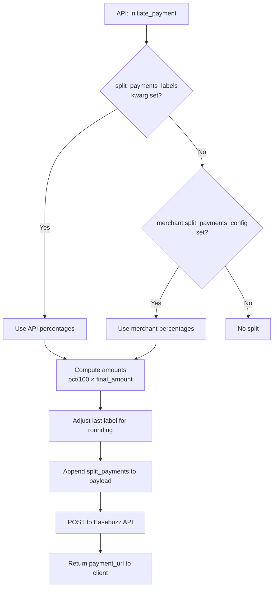
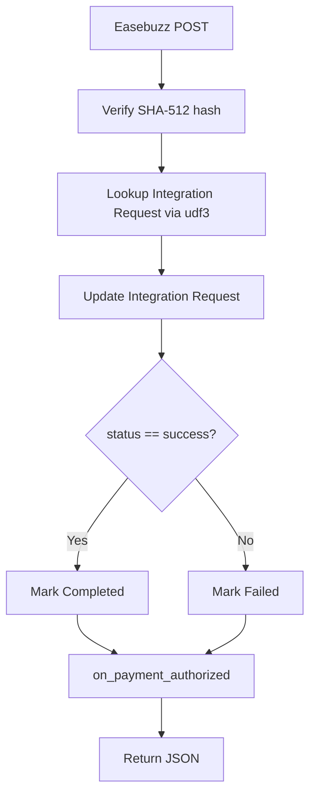

# Agent Skill — Easebuzz Split Payments

**Domain:** Payment Gateway Integration  
**Scope:** Easebuzz split payments, webhooks, percentage-based configuration  
**Version:** 2.0 (April 2026)

---

## What this skill covers

1. Configuring percentage-based split payments in `Easebuzz Merchant`
2. Using the `split_payments_labels` API parameter for dynamic per-transaction splits
3. Webhook setup for both normal and split payments
4. Debugging payment / webhook / hash issues

---

## Key Facts

| Fact | Detail |
|------|--------|
| Split config format | JSON object — **values are percentages** that must sum to 100 |
| Minimum labels | 2 (validation enforced on merchant save) |
| Amount computation | Done server-side in `create_payment_request_data()` |
| Priority | API param > merchant config > no split |
| Hash | `split_payments` field is **NOT** included in the SHA-512 hash |
| Webhook endpoint | `...easebuzz_settings.webhook_callback` — handles all payment types |
| Redirect callback | `...easebuzz_settings.verify_transaction?merchant=<name>` |

---

## Configuration Reference

### Easebuzz Merchant — `split_payments_config`

```json
{
  "label_platform": 10,
  "label_vendor_a": 55,
  "label_vendor_b": 35
}
```

- Values are **percentage** shares (must sum to 100)
- Labels are provided by the Easebuzz team
- Validated on save: JSON format, ≥2 labels, each 0<pct≤100, total=100±0.01

### API call — `split_payments_labels`

```python
frappe.call(
    "payments.payment_gateways.doctype.easebuzz_settings.easebuzz_settings.initiate_payment",
    amount=1000,
    split_payments_labels={"label_a": 60, "label_b": 40},  # percentages
    ...
)
```

---

## Webhook Setup

Configure in Easebuzz dashboard:

```
https://<your-site>/api/method/payments.payment_gateways.doctype.easebuzz_settings.easebuzz_settings.webhook_callback
```

Add `?merchant=<merchant_name>` when multiple merchants are configured.

---

## Flow Diagrams

### Split Payment (high-level)



### Webhook / Callback (high-level)



---

## Troubleshooting Quick Reference

| Error / Symptom | Action |
|-----------------|--------|
| `percentages must sum to 100` | Fix merchant config or API param values |
| `at least 2 labels required` | Add second label |
| Hash verification failed | Check correct merchant salt is being used |
| Webhook not received | Verify URL in Easebuzz dashboard, confirm site is reachable |
| Labels rejected by Easebuzz | Contact Easebuzz support to enable labels |

---

## Files Changed

| File | Change |
|------|--------|
| `easebuzz_merchant.json` | `split_payments_config` description updated; field label updated |
| `easebuzz_merchant.py` | `validate_split_payments_config` — validates percentages |
| `easebuzz_settings.json` | Added Webhook URL info section |
| `easebuzz_settings.py` | `create_payment_request_data` — converts pct → amounts |
| `test_easebuzz_merchant.py` | Updated for percentage rules |
| `test_easebuzz_settings.py` | Updated for amount output assertions |
| `EASEBUZZ_SPLIT_PAYMENTS.md` | Full rewrite with Mermaid diagrams |
| `EASEBUZZ_INTEGRATION.md` | Updated split payments section |
