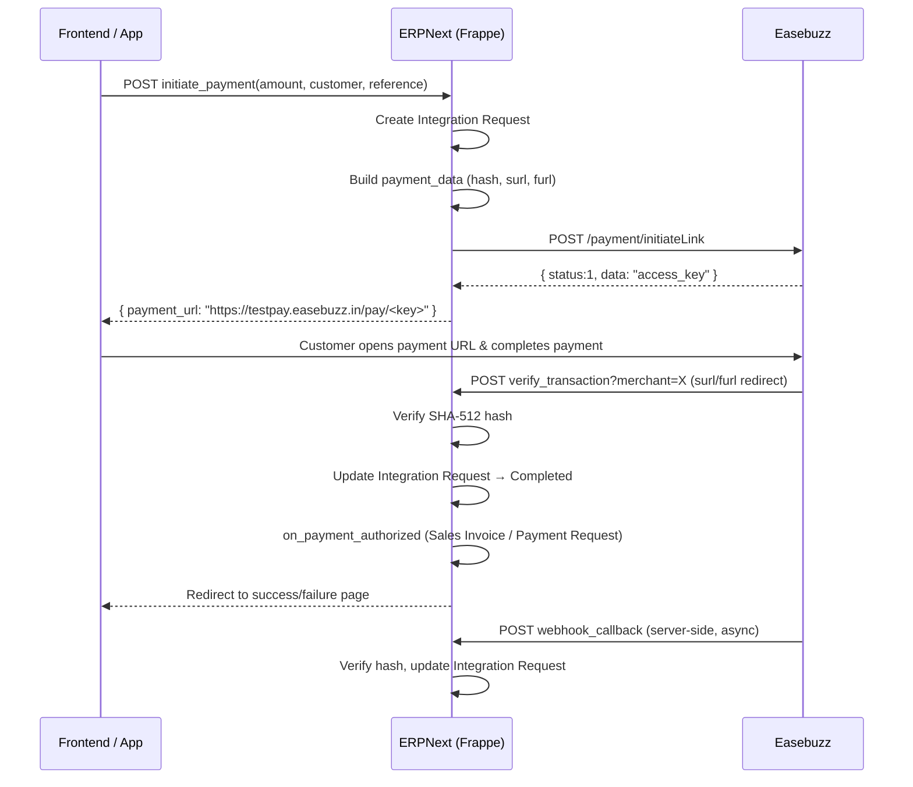
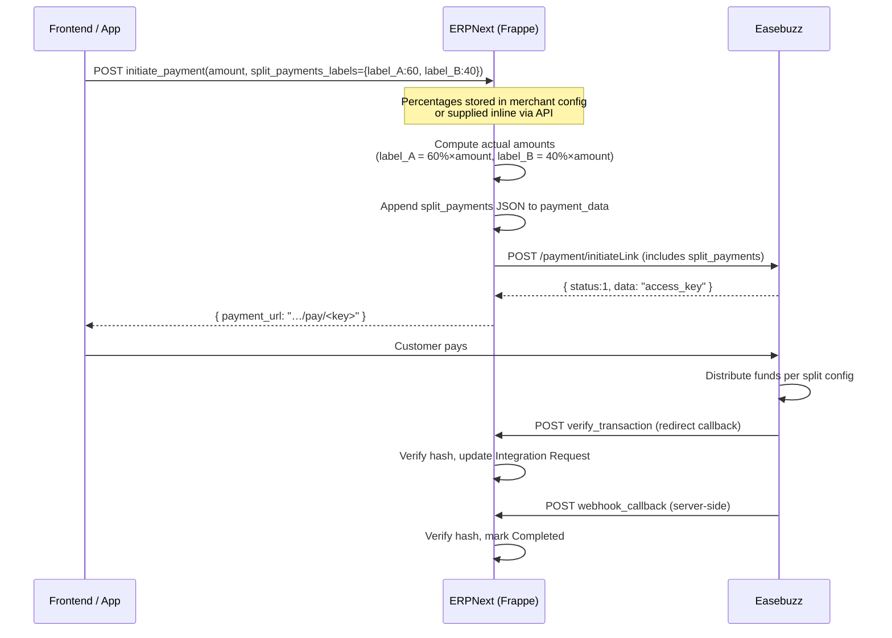
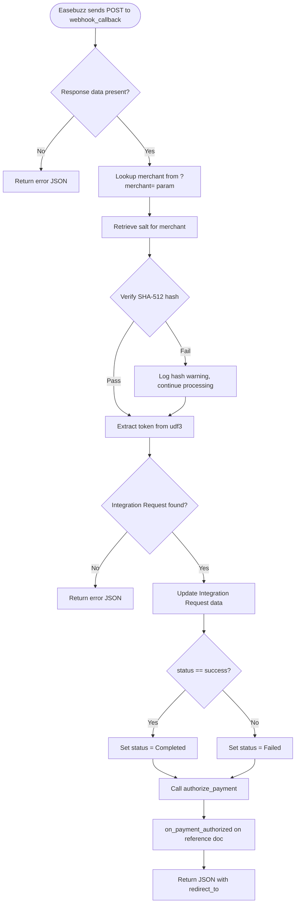
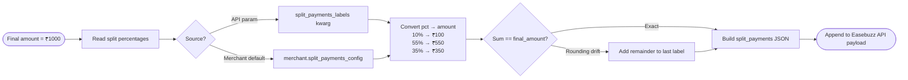

# Easebuzz Split Payments — Integration Guide

> **Configuration uses percentages.**  
> You define how much of the transaction each label receives as a percentage (must sum to 100).  
> The actual INR amounts are computed server-side at payment time.

---

## Table of Contents

1. [What are Split Payments?](#1-what-are-split-payments)
2. [Prerequisites](#2-prerequisites)
3. [Flow Diagrams](#3-flow-diagrams)
4. [Configuration](#4-configuration)
5. [API Usage](#5-api-usage)
6. [Webhook Setup](#6-webhook-setup)
7. [Examples](#7-examples)
8. [Testing (UAT)](#8-testing-uat)
9. [Troubleshooting](#9-troubleshooting)
10. [FAQ](#10-faq)

---

## 1. What are Split Payments?

Split payments is an Easebuzz feature that automatically distributes a single transaction among multiple accounts.  Each "label" is a pre-registered sub-account provided by the Easebuzz team.

**Common use-cases**

| Use-case | Example |
|----------|---------|
| Marketplace | Platform 10 %, vendor 90 % |
| Multi-campus university | Campus A 45 %, Campus B 45 %, Central Fund 10 % |
| Commission system | Agent 5 %, Principal 95 % |

---

## 2. Prerequisites

- Easebuzz merchant account with **split payments enabled**
- **Labels** (e.g. `label_HDFC`, `label_platform`) obtained from Easebuzz support
- ERPNext / Frappe with this payments app installed
- At least **2 labels** per configuration

---

## 3. Flow Diagrams

### 3.1 Normal (non-split) Payment Flow



### 3.2 Split Payment Flow



### 3.3 Webhook Flow



### 3.4 Split Amount Calculation



---

## 4. Configuration

### 4.1 Merchant-level default (recommended for consistent splits)

1. Open **Payment Gateways → Easebuzz Merchant**
2. Scroll to **Split Payments Configuration**
3. Enter a JSON object — **values are percentages**, must sum to 100

```json
{
  "label_platform": 10,
  "label_vendor_a": 55,
  "label_vendor_b": 35
}
```

**Validation enforced on save:**

| Rule | Detail |
|------|--------|
| Valid JSON object | Must be `{…}` |
| ≥ 2 labels | At minimum 2 entries |
| Each pct > 0 and ≤ 100 | No zero or negative shares |
| Sum = 100 (±0.01) | Allows `33.33 + 33.33 + 33.34` |

### 4.2 Per-transaction override via API

Pass `split_payments_labels` in the `initiate_payment` call to override the merchant default for a single transaction.

```json
{
  "amount": 1000,
  "split_payments_labels": {
    "label_platform": 10,
    "label_vendor_a": 55,
    "label_vendor_b": 35
  }
}
```

**Priority:** `split_payments_labels` (API) > `split_payments_config` (merchant) > no split

---

## 5. API Usage

**Endpoint:**
```
POST /api/method/payments.payment_gateways.doctype.easebuzz_settings.easebuzz_settings.initiate_payment
```

### 5.1 Minimal request (merchant default splits)

```json
{
  "amount": 1000,
  "reference_doctype": "Sales Invoice",
  "reference_docname": "SINV-2026-00001",
  "payer_email": "student@example.com",
  "payer_name": "CUST-00001",
  "company": "Campus A Ltd"
}
```

### 5.2 Request with explicit splits

```json
{
  "amount": 1000,
  "reference_doctype": "Sales Invoice",
  "reference_docname": "SINV-2026-00001",
  "payer_email": "student@example.com",
  "payer_name": "CUST-00001",
  "company": "Campus A Ltd",
  "split_payments_labels": {
    "label_platform": 10,
    "label_vendor_a": 55,
    "label_vendor_b": 35
  }
}
```

### 5.3 Response

```json
{
  "message": {
    "success": true,
    "payment_token": "IR-2026-00001",
    "payment_url": "https://testpay.easebuzz.in/pay/abc123...",
    "txnid": "IR-2026-00001",
    "merchant_name": "Campus A Merchant"
  }
}
```

---

## 6. Webhook Setup

> The webhook endpoint handles **both normal and split payments**.  No extra configuration is needed — the same endpoint works for all payment types.

### 6.1 Webhook URL

Configure this in the **Easebuzz merchant dashboard**:

```
https://<your-site-domain>/api/method/payments.payment_gateways.doctype.easebuzz_settings.easebuzz_settings.webhook_callback
```

Add `?merchant=<merchant_name>` if you have multiple merchants, e.g.:

```
https://your-site.com/api/method/...webhook_callback?merchant=Campus+A+Merchant
```

### 6.2 Redirect callback (surl / furl)

Set automatically per merchant — looks like:

```
https://<your-site>/api/method/...verify_transaction?merchant=<merchant_name>
```

You can also see both URLs in the **Easebuzz Settings** doctype under *Webhook / Callback URLs*.

### 6.3 What the webhook does

1. Receives POST from Easebuzz
2. Verifies SHA-512 hash (logs warning if mismatch, continues)
3. Looks up the Integration Request via `udf3` (token)
4. Updates the Integration Request status
5. Calls `on_payment_authorized` on the reference document
6. Returns JSON `{ success, status, transaction_id, redirect_to }`

### 6.4 Security — hash verification

The response hash uses the sequence:

```
salt|status|udf10|udf9|udf8|udf7|udf6|udf5|udf4|udf3|udf2|udf1|email|firstname|productinfo|amount|txnid|key
```

This is implemented in `verify_response_hash()` in `easebuzz_utils.py`.

---

## 7. Examples

### 7.1 Marketplace — 10 % platform fee

**Merchant config (static):**
```json
{
  "label_platform": 10,
  "label_vendor_abc": 90
}
```

API call (no extra field needed):
```python
result = frappe.call(
    "payments.payment_gateways.doctype.easebuzz_settings.easebuzz_settings.initiate_payment",
    amount=1000,
    reference_doctype="Sales Order",
    reference_docname="SO-001",
    payer_email="buyer@example.com",
    payer_name="CUST-001",
)
```

Easebuzz receives: `{"label_platform": 100.0, "label_vendor_abc": 900.0}` (computed from ₹1000)

---

### 7.2 Multi-campus university — 3-way split

**Merchant config:**
```json
{
  "label_campus_a": 45,
  "label_campus_b": 45,
  "label_central_fund": 10
}
```

For a ₹50,000 payment: `label_campus_a=22500, label_campus_b=22500, label_central_fund=5000`

---

### 7.3 Dynamic per-transaction commissions

```python
def create_order_payment(order):
    commission_pct = get_vendor_commission_rate(order.vendor)  # e.g. 8.5
    vendor_pct = 100 - commission_pct  # 91.5

    return frappe.call(
        "...initiate_payment",
        amount=order.grand_total,
        reference_doctype="Sales Order",
        reference_docname=order.name,
        payer_email=order.customer_email,
        payer_name=order.customer,
        split_payments_labels={
            "label_platform": commission_pct,
            "label_vendor": vendor_pct,
        },
    )
```

---

### 7.4 Four equal partners (25 % each)

```json
{
  "split_payments_labels": {
    "label_partner_1": 25,
    "label_partner_2": 25,
    "label_partner_3": 25,
    "label_partner_4": 25
  }
}
```

---

## 8. Testing (UAT)

1. **Get test labels** from Easebuzz — labels look like `label_HDFC`, `label_testaccount`, etc.
2. Create a merchant in ERPNext with Environment = **Test**
3. Set `split_payments_config`:
   ```json
   { "label_test_a": 70, "label_test_b": 30 }
   ```
4. Call `initiate_payment` and open the returned URL: `https://testpay.easebuzz.in/pay/<key>`
5. Complete the payment using Easebuzz test cards
6. Verify webhook fires — check **Integration Requests** in ERPNext
7. Verify split amounts appear correctly in the Easebuzz UAT dashboard

### Checklist

- [ ] Merchant config saves without errors
- [ ] Percentages that don't sum to 100 are rejected
- [ ] Payment initiation returns a valid URL
- [ ] Payment completes
- [ ] Webhook callback updates Integration Request to *Completed*
- [ ] Split amounts in Easebuzz dashboard match expected values

---

## 9. Troubleshooting

| Symptom | Likely Cause | Fix |
|---------|-------------|-----|
| `ValidationError: percentages must sum to 100` | Config adds up to ≠ 100 | Recalculate so total = 100 |
| `ValidationError: at least 2 labels required` | Only one label in config | Add a second label |
| Payment page loads but payment fails | Labels not enabled on Easebuzz account | Contact Easebuzz support |
| Hash verification failed in error log | Wrong salt for the merchant | Check salt in Merchant config |
| `Integration Request not found` | Wrong `udf3` token | Check token storage in `create_payment_request_data` |
| Webhook not received | Wrong webhook URL in Easebuzz dashboard | Reconfigure with correct domain + path |

---

## 10. FAQ

**Q: Can I have more than 2 merchants in a split?**  
Yes. Add as many labels as you need — just ensure they sum to 100.

**Q: Are the split_payments_labels values percentages or INR amounts?**  
Always **percentages**. The system converts them to actual amounts at runtime.

**Q: What happens if my percentages are 33.33, 33.33, 33.34 — will it work?**  
Yes. The sum is 100.00 (within the 0.01 tolerance), and the system handles rounding automatically.

**Q: Does the webhook endpoint work for normal (non-split) payments?**  
Yes. The `webhook_callback` endpoint processes both. Split logic is transparent to the webhook.

**Q: How do I configure the webhook in the Easebuzz dashboard?**  
Use the URL shown under *Webhook / Callback URLs* in Easebuzz Settings:  
`https://<site>/api/method/...easebuzz_settings.webhook_callback`

**Q: Can each merchant have different split configs?**  
Yes. Each `Easebuzz Merchant` record has its own `split_payments_config`.

**Q: What is the priority when both `split_payments_labels` and merchant config are set?**  
API parameter wins. Order: API kwarg → merchant config → no split.

**Q: Are refunds affected by splits?**  
Easebuzz handles refund reversal automatically proportional to the original split.
